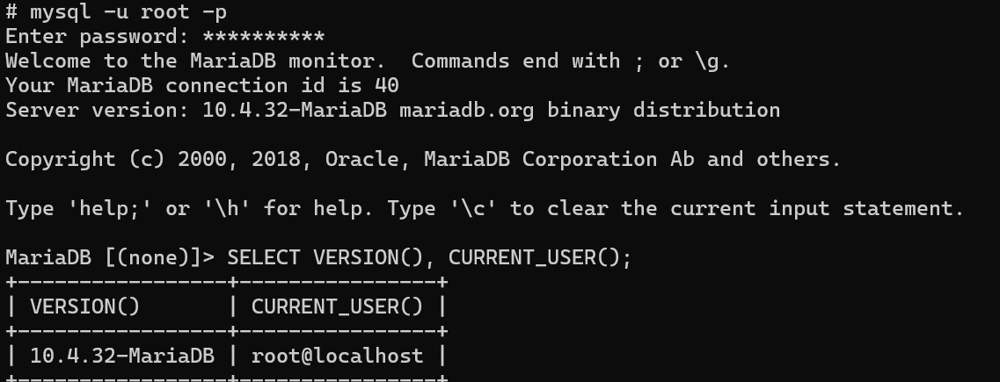
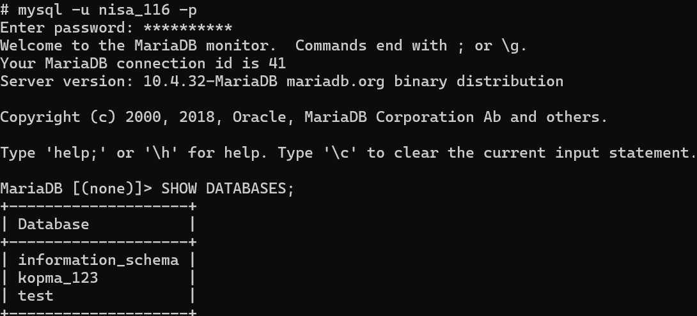

# Laporan Praktikum Basis Data - Pertemuan 01

**Nama:** Narti Khoirunisa  
**NIM:** 25430116  
**Kelas:** D  
**Tanggal:** 06 Oktober 2026  





## 1. Tujuan Praktikum
1. Menjalankan dan menghentikan layanan MariaDB melalui XAMPP Control Panel serta membaca status dan port-nya.
2. Terhubung ke server MariaDB melalui klien baris perintah (CLI) dan phpMyAdmin, lalu menjelaskan perbedaan keduanya.
3. Mengamankan akun root dengan password dan membuat akun kerja yang hak aksesnya terbatas pada satu basis data.
4. Membuat basis data pertama dan mencatat pekerjaan ke repositori Git yang terhubung ke GitHub.

## 2. Ringkasan Dasar Teori
Basis data adalah kumpulan data terorganisasi yang dikelola oleh DBMS agar dapat digunakan bersama secara efisien. MariaDB menggunakan arsitektur klien-server di mana server (`mysqld`) mendengarkan pada port 3306 dan menerima perintah dari klien seperti CLI `mysql` atau phpMyAdmin. Dalam praktikum ini digunakan XAMPP 8.2.12 (MariaDB 10.4.32) di lingkungan Windows. Berdasarkan prinsip *least privilege* (hak akses minimum), akun `root` hanya digunakan untuk administrasi, sedangkan pengelolaan basis data harian menggunakan akun khusus. Selain itu, Git digunakan sebagai sistem kendali versi untuk melacak perkembangan tugas secara bertahap melalui mekanisme *staging*, *commit*, dan *push*.

## 3. Hasil Langkah Percobaan
* **Verifikasi Server & Versi:** Berhasil menyalakan modul MySQL pada XAMPP Control Panel di port 3306 dan menjalankan kueri:

  ```sql
  SELECT VERSION(), CURRENT_USER();
  SELECT @@sql_mode;

```

* **Pengamanan Akun Root & Pembuatan Basis Data Proyek:** Mengatur password untuk akun `root` di berbagai host (`localhost`, `127.0.0.1`, `::1`) serta membuat basis data `toko_116` dengan format karakter `utf8mb4`.
* **Pembuatan Akun Kerja:** Membuat akun `dev_116` yang hanya diberikan hak akses penuh (`GRANT ALL PRIVILEGES`) pada basis data `toko_116.*`.
* **Konfigurasi phpMyAdmin & Git:** Mengubah parameter `auth_type` pada berkas `config.inc.php` menjadi `'cookie'` agar aman, serta melakukan inisialisasi repositori Git lokal dan *push* pertama ke GitHub.

## 4. Jawaban Titik Analisis

* **Titik Analisis 1:** Meskipun XAMPP menggunakan label tombol "MySQL", server yang berjalan sebenarnya adalah MariaDB 10.4. Konsekuensinya, untuk penanganan galat (*error codes*) yang spesifik, dokumentasi resmi MariaDB harus lebih diutamakan dibandingkan dokumentasi umum MySQL.
* **Titik Analisis 2:** Ketika mencoba masuk dengan `mysql -u root` tanpa `-p` setelah akun root diberi password, server menolak dengan galat `ERROR 1045` dan keterangan `using password: NO`, yang menandakan bahwa klien tidak menyertakan argumen password saat melakukan permintaan sambungan.
* **Titik Analisis 3:** Akun kerja (`dev_116`) tetap dapat melihat `information_schema` karena merupakan basis data sistem global yang transparan, namun akses ke basis data lain seperti `mysql` ditolak dengan `ERROR 1044` (*Access denied*) karena batasan hak istimewa (*privileges*).
* **Titik Analisis 4:** Mode *cookie* pada phpMyAdmin jauh lebih aman daripada mode *config* karena mewajibkan pengguna mengetikkan kata sandi secara manual setiap kali masuk, sehingga tidak ada kredensial sensitif yang tersimpan secara permanen di dalam berkas konfigurasi teks terbuka.

## 5. Hasil Latihan dan Modifikasi

* **Uji Coba Akun Terbatas (`SHOW DATABASES`):**
* **Pesan Galat Akses Ditolak (`ERROR 1044`):**
* **Halaman Masuk phpMyAdmin (Mode Cookie):**

## 6. Tugas Mandiri: Milestone Proyek 01

* **Tema Proyek (NIM 25430116 -> 2 digit terakhir 16):** Toko Daring (Kode tema: `toko`)
* **Nama Basis Data Proyek:** `toko_116`
* **Akun Pengembang:** `dev_116`
* **Identitas Proyek (`README.md`):**
* Nama Organisasi Fiktif: **Toko Daring Berkah Jaya NK** (memuat inisial NK)
* Lingkup Layanan: Menyediakan platform pengelolaan produk, transaksi keranjang belanja, pencatatan pemesanan, dan manajemen pengiriman barang secara digital bagi civitas akademika dan umum.


* **Berkas Pengamanan (`.gitignore`):** Dibuat untuk mengecualikan berkas sensitif seperti `*.env` dan `kredensial*.txt` agar tidak ter-commit ke GitHub.

## 7. Pembahasan dan Kendala

Kendala utama yang sering ditemui adalah port 3306 yang terpakai oleh layanan MySQL lain (bawaan sistem atau instalasi terpisah). Kendala ini dapat diatasi dengan mematikan layanan terkait melalui *Windows Services* atau menggunakan perintah `netstat` untuk menghentikan proses PID yang menghalangi.

## 8. Kesimpulan

Lingkungan kerja basis data MariaDB di XAMPP dan Git berhasil disiapkan dengan aman. Prinsip hak akses minimum (*least privilege*) telah diterapkan melalui pembuatan akun khusus proyek toko daring, dan seluruh riwayat pengerjaan telah berhasil dicatat ke dalam repositori GitHub.

## 9. Pernyataan Penggunaan AI

* **Alat yang dipakai:** Asisten AI
* **Tujuan penggunaan:** Membantu memvalidasi struktur format laporan praktikum, menjelaskan alur pesan galat, serta menyusun kerangka penjelasan analitis.
* **Bagian yang terbantu:** Perumusan tata letak laporan dan penjelasan Titik Analisis.

## 10. Bukti Git

* **Tautan Repositori:** https://github.com/nartikhoirunisa07/basisdata-25430116
* **Hash Commit:** 3f9c2ab

## Checklist

* [x] Tujuan Praktikum
* [x] Ringkasan Dasar Teori
* [x] Hasil Langkah Percobaan
* [x] Jawaban Titik Analisis
* [x] Hasil Latihan dan Modifikasi
* [x] Tugas Mandiri
* [x] Pembahasan dan Kendala
* [x] Kesimpulan
* [x] Pernyataan Penggunaan AI
* [x] Bukti Git untuk isi dari laporan p01

```

